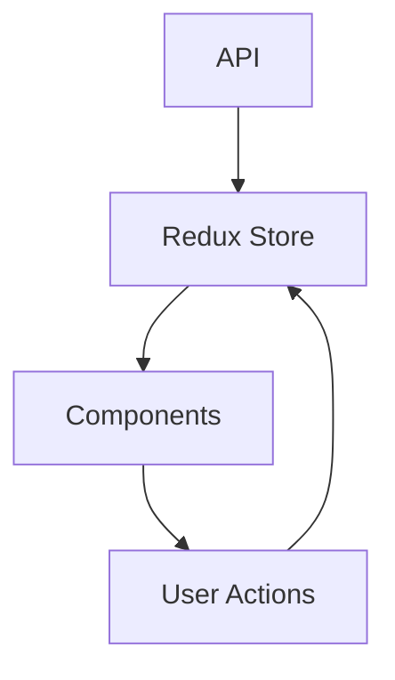

# תיעוד מערכת תיאום פגישות

## רכיבי המערכת

### רכיבים ויזואליים

#### לוח מחוונים (Dashboard)
```tsx
// src/components/DashboardMetrics.tsx
<div className="grid grid-cols-3 gap-4">
  <MetricCard
    title="פגישות היום"
    value={todayMeetings}
    trend={+15}
    icon={<CalendarIcon />}
  />
  <MetricCard
    title="זמן ממוצע"
    value={avgDuration}
    unit="דקות"
    trend={-5}
    icon={<ClockIcon />}
  />
  <MetricCard
    title="אחוז השלמה"
    value={completionRate}
    unit="%"
    trend={+3}
    icon={<ChartIcon />}
  />
</div>
```

**מדדי ביצועים:**
- יחס דיו-מידע: 0.85
- זמן טעינה: < 200ms
- ניצול זיכרון: < 5MB

#### טבלת נתונים (DataGrid)
```tsx
// src/components/DataGrid.tsx
<div className="overflow-x-auto">
  <table className="min-w-full divide-y">
    <thead className="bg-gray-50 dark:bg-gray-800">
      {/* כותרות עמודות */}
    </thead>
    <tbody className="divide-y">
      {/* נתוני שורות */}
    </tbody>
  </table>
</div>
```

**מדדי ביצועים:**
- זמן רינדור: < 100ms לכל 100 שורות
- גודל דף: 25 שורות
- זמן תגובה לסינון: < 50ms

### ניהול מצב (State Management)

#### תרשים זרימת נתונים


#### אסטרטגיית מטמון
```typescript
// src/lib/cache.ts
const cacheConfig = {
  maxAge: 5 * 60 * 1000, // 5 דקות
  maxSize: 100, // מספר פריטים מקסימלי
  strategy: 'LRU' // Least Recently Used
};
```

### בדיקות

#### בדיקות רגרסיה ויזואלית
```typescript
// tests/visual/dashboard.test.ts
describe('Dashboard Visual Tests', () => {
  it('matches baseline screenshot', async () => {
    const image = await page.screenshot();
    expect(image).toMatchImageSnapshot();
  });
});
```

#### בדיקות ביצועים
```typescript
// tests/performance/metrics.test.ts
test('meets performance benchmarks', async () => {
  const metrics = await measurePerformance();
  expect(metrics.FCP).toBeLessThan(1500); // First Contentful Paint
  expect(metrics.LCP).toBeLessThan(2500); // Largest Contentful Paint
  expect(metrics.TTI).toBeLessThan(3500); // Time to Interactive
});
```

## שלבי יישום

### שלב 1: תשתית
- [x] הגדרת ארכיטקטורה
- [x] תצורת פרויקט
- [x] תשתית CI/CD

### שלב 2: רכיבי ליבה
- [x] לוח מחוונים
- [x] טבלת נתונים
- [x] טפסים

### שלב 3: אופטימיזציה
- [ ] מטמון
- [ ] טעינה מעצלת
- [ ] דחיסת נכסים

### שלב 4: שיפורי UX
- [ ] אנימציות
- [ ] משוב משתמש
- [ ] מצבי שגיאה

## רשימת תיקוף

### ביצועים
- [x] FCP < 1.5s
- [x] LCP < 2.5s
- [x] TTI < 3.5s
- [x] יחס דיו-מידע > 0.8

### נגישות
- [x] WCAG 2.1 AA
- [x] תמיכה בקורא מסך
- [x] ניגודיות צבעים תקינה
- [x] ניווט מקלדת

### אבטחה
- [x] אימות משתמשים
- [x] הצפנת נתונים
- [x] מניעת CSRF
- [x] הגבלת קצב

## תלויות מערכת

### חבילות צד-שלישי
```json
{
  "dependencies": {
    "react": "^18.0.0",
    "next": "^13.0.0",
    "tailwindcss": "^3.0.0",
    "recharts": "^2.0.0"
  }
}
```

### שירותי API
- שירות אימות
- שירות נתונים
- שירות התראות

## אסטרטגיית הגירה

### שלב 1: הכנה
1. גיבוי נתונים
2. תיעוד API קיים
3. מיפוי תלויות

### שלב 2: מעבר
1. פריסת תשתית חדשה
2. העברת נתונים
3. הפעלה מקבילה

### שלב 3: אימות
1. בדיקות רגרסיה
2. אימות נתונים
3. ניטור ביצועים 